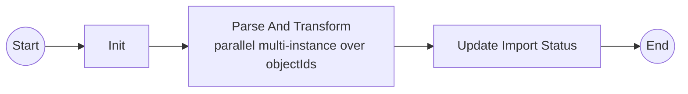

# bpm.cgm.import

## Purpose

`bpm.cgm.import` owns the CGM import BPMN process definition and Camunda delegates. It is a runnable Spring Boot module with an embedded Camunda Platform engine.

The module calls `srv.cgm.importer` over REST. The service module does not have a Maven dependency on this BPM module.

## BPMN

Process id: `cgm-import`



### Process Variables

- `importStatus`: the `ImportStatus` payload created by `srv.cgm.importer`.
- `networkId`: CGM network id.
- `objectIds`: raw CGMES object ids stored in MinIO.
- `objectId`: current object id in the multi-instance parse/transform task.

## Delegates

- `InitCgmImportDelegate`: reads `ImportStatus`, extracts object ids, and initializes process variables.
- `ParseAndTransformDelegate`: calls `srv.cgm.importer` `CgmesTransform` REST API for each object id. Failures are written back to import status before the task fails.
- `UpdateImportStatusDelegate`: marks final status-update completion in the process context.

## REST API

- `POST /api/bpm/cgm-imports/start`
  - Starts process id `cgm-import` with an `ImportStatus` body.
- `POST /api/bpm/cgm-imports/callback`
  - Correlates an external callback message into the embedded Camunda engine through `InfrastructureUtils`.
- `GET /api/bpm/cgm-imports/instances/{processInstanceId}`
  - Reads process-instance state through `InfrastructureUtils`.

## Configuration

The module sets `module=bpm.cgm.import` at startup and loads YAML config through `com.utils`.

```yaml
server:
  port: 8083

camunda:
  bpm:
    auto-deployment-enabled: true
    deployment-resource-pattern:
      - classpath*:/bpmn/*.bpmn

bpm:
  cgm:
    import:
      service-base-url: http://localhost:8080
```

## Developer Commands

From the repository root:

```bash
mvn -Dmaven.repo.local=work/m2 -Ddocker.skip.build=true -Ddocker.skip.push=true -pl bpm.cgm.import -am test
```

Build the BPM Docker image:

```bash
mvn -Dmaven.repo.local=work/m2 -Ddocker.skip.push=true -pl bpm.cgm.import -am package
```
