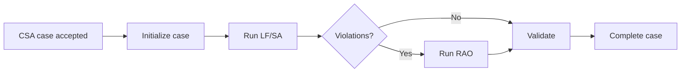

# bpm.csa.service

`bpm.csa.service` is the Camunda-backed CSA process module. It owns the
`csa-end-to-end` BPMN process and exposes process-neutral endpoints compatible
with `com.infra.bpm.remote.RemoteBusinessProcessService`.

## Process



## Developer Command

```bash
mvn -Dmaven.repo.local=work/m2 \
  -Ddocker.skip=true -Ddocker.skip.build=true -Ddocker.skip.push=true \
  -pl bpm.csa.service -am test
```
