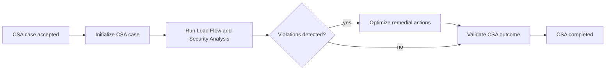

# bpm.csa.service

Camunda-backed CSA process module.

It owns the `csa-end-to-end` BPMN definition and exposes the remote BPM REST API
shape consumed by `com.infra.bpm.remote.RemoteBusinessProcessService`.

