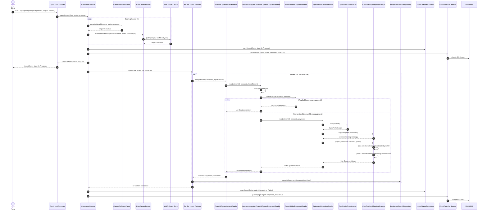
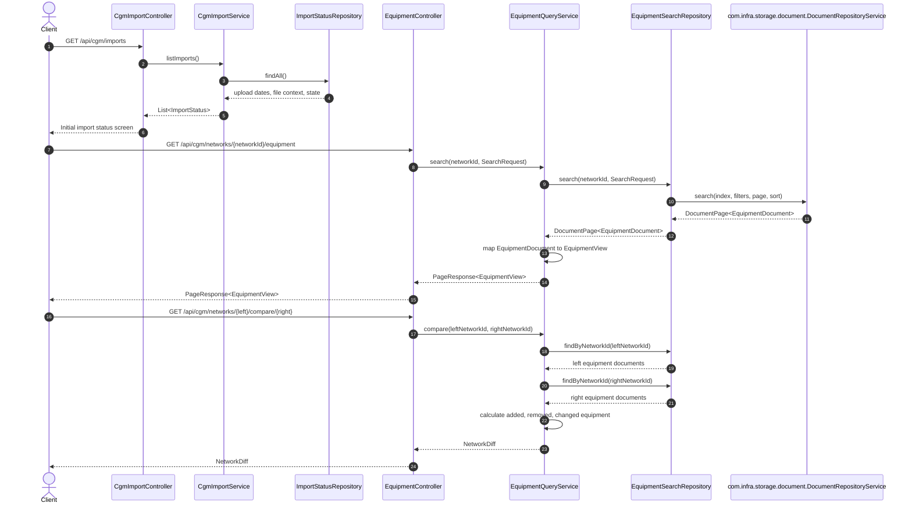
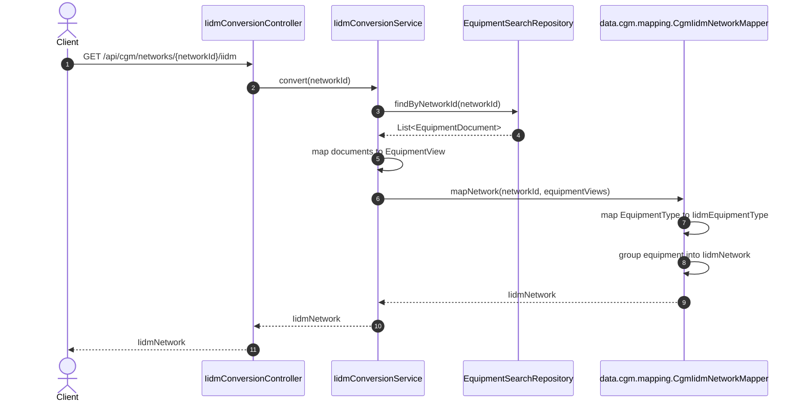

# CGM Import Detail Design

This document describes the runtime invocation paths for CGM import, explore, and IIDM projection. The implementation keeps service orchestration in `srv.cgm.importer`, shared CGM data behavior in `data.cgm`, and generic transformer contracts in `com.mapping`.

## Package Boundaries

- `srv.cgm.importer`: REST controllers, service orchestration, storage/index/event adapters.
- `data.cgm.dto.cgmes`: CGMES-facing API and search DTOs.
- `data.cgm.dto.iidm`: IIDM-facing DTOs.
- `data.cgm.mapping`: CGMES filename parsing, PowSyBl-backed reading, fallback graph loading, topology strategies, and IIDM DTO projection.
- `com.mapping`: generic mapping and transformer contracts.
- `com.infra.storage.document`: generic document repository contracts consumed by import-status and equipment repositories.
- `com.infra.storage.object`: generic object-storage contract used by raw CGMES upload storage.
- `com.infra.event`: generic event-publishing contract used for import lifecycle messages.
- `map.cgm`: reusable CGMES/IIDM transformer implementation using `com.mapping`.

## 1. Import Flow

## 2. Explore Flow

## 3. IIDM Flow

## Design Notes

- `srv.cgm.importer` orchestrates workflows and persistence but does not import PowSyBl APIs.
- `data.cgm` owns the CGMES reading details and contains all PowSyBl CGMES/IIDM dependencies.
- Fallback RDF/XML projection uses an interim `CgmProfileGraph` and a two-pass strategy pipeline instead of direct raw XML-to-IIDM mapping.
- Node-breaker and bus-branch behavior is selected through `CgmTopologyMappingStrategy`, allowing future topology variants without changing service orchestration.
