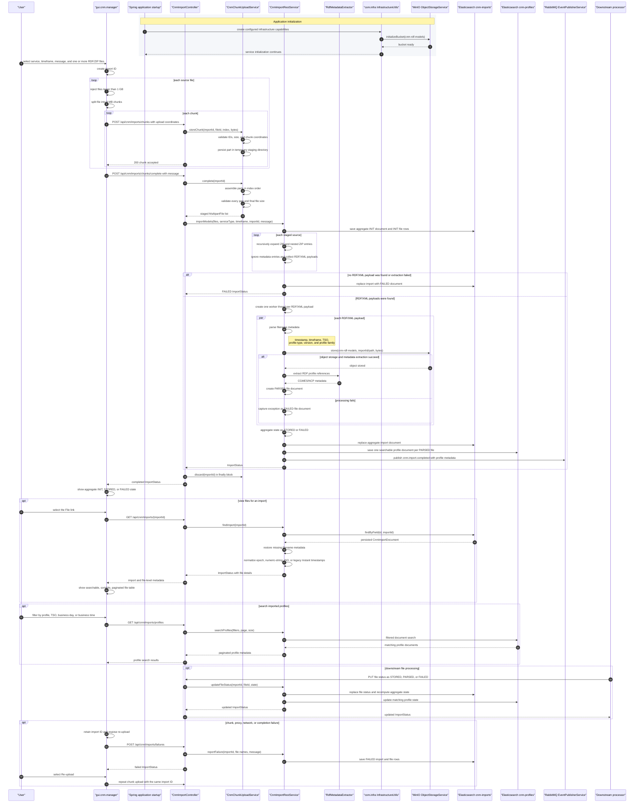

# CNM Import Design

## Purpose

The Common Network Model (CNM) import application is the first application surface for RDF-based grid model intake. It supports Common Grid Model (CGM), Coordinated Security Analysis (CSA), and Capacity Calculation (CC) use cases across intra-day, day-ahead, and day-two timeframes.

The initial implementation focuses on import orchestration, metadata capture, and reusable module boundaries. Semantic graph validation, PowSyBl-backed IIDM transformation, CSA, and CC calculation flows are expected to build on this foundation.

## Profile Sources

The application accepts RDF profile files aligned with the ENTSO-E application profile library. The profile repository organizes CGMES and NCP profile definitions into dedicated folders and publishes RDFS, SHACL, and profile metadata packages. Import code should treat these profile definitions as external contracts, not as hand-written business assumptions.

## Modules

- `data.cnm`: transport DTOs shared by GUI, service, and mock modules. Packages are separated into `common`, `cgmes`, `ncp`, and `iidm`.
- `srv.cnm.services`: Spring Boot REST service exposing CNM import APIs and OpenAPI documentation.
- `mock.srv.cnm.services`: Spring Boot mock service with in-memory import data for GUI development.
- `gui.common`: Vue shared components for buttons, links, menus, dropdowns, and searchable/sortable/paginated tables.
- `gui.cnm.manager`: Vue application for RDF upload and import status visualization.

## Import Scope

The first import flow does not map raw XML/RDF directly into IIDM objects. It extracts RDF metadata, classifies profile references as CGMES or NCP where possible, stores the raw payload in object storage through `com.infra`, and persists import metadata in the document store through `com.infra`.

Later semantic import stages should load RDF into a graph or intermediate model before mapping. Complex relationship resolution should use a two-pass pipeline:

1. Instantiate core objects and store them by mRID.
2. Resolve topology and associations using lookup maps.

Strategy-based mapping should be used when topology or profile metadata indicates different mapping behavior, such as bus-branch and node-breaker variants.

## REST Surface

The production service owns the OpenAPI contract under `srv.cnm.services/src/main/resources/openapi/cnm-services.yaml`.

Initial endpoints:

- `POST /api/cnm/imports`: accepts service type, timeframe, optional message, and RDF profile file.
- `POST /api/cnm/imports/failures`: records an upload rejected by a proxy, network, or multipart boundary.
- `GET /api/cnm/imports`: returns import status rows with optional free-text filtering.
- `GET /api/cnm/imports/{importId}`: returns a single import status.
- `PUT /api/cnm/imports/{importId}/files/{fileId}/status`: accepts downstream file-state updates.

The mock service follows the same route shape for GUI development.

## Sequence



## Large Uploads And Retry

The GUI splits each source file into 8 MB binary chunks and supports a logical
file size of up to 1 GB. Nginx and Spring use a 16 MB per-request limit. The
service stages chunks on disk, validates completeness and size, then starts the
existing ZIP/RDF import pipeline.

The GUI creates the import ID before sending the multipart request. If a proxy or network error prevents the multipart request from reaching the service, the GUI sends a small failure report so the import still appears with `FAILED` status. Re-upload replaces that document under the same import ID, first with `INIT` and then with the completed or failed per-file state.

The aggregate import table intentionally omits profile columns because one
source bundle can contain multiple profiles. Its File column links to a
dedicated detail view using the same shared table behavior. Successful imports
finish as `STORED`; the only aggregate states are `INIT`, `STORED`, and
`FAILED`. The optional message entered beside the RDF model selector is stored
on `ImportStatus`.

File lifecycle is intentionally separate. `ImportFileState` contains `INIT`,
`STORED`, `PARSED`, and `FAILED`. A parsed file does not add `PARSED` to the
aggregate lifecycle; a set of stored or parsed files yields aggregate
`STORED`, while any failed file yields aggregate `FAILED`. Downstream event
handlers or services use the file-status callback to persist their progress.

The filename pattern
`<Timestamp>_<Time Frame>_<TSO Name>_<Profile Type>_<Version>` populates both
the import-file document and profile document. The literal profile code,
derived profile family, and file state are separate fields. New persisted
timestamps are epoch milliseconds. Document fields are read schema-tolerantly,
then numeric, numeric-string, ISO, and legacy `Instant` values are normalized
to API `Instant` values when responses are assembled. Missing business day and
business time values are reconstructed from the filename.

Filename metadata is authoritative for profile type, TSO, timeframe, version,
business day, and business time. For example,
`20241202T2330Z_1D_TSCNET-EU_SV_002.xml` is stored as profile `SV`, business day
`2024-12-02`, and business time `23:30`.

After successful object storage, the service stores profile metadata in the
`cnm-profiles` Elasticsearch index and publishes a `cnm.import.completed` event
through `com.infra`. The profile search API filters by profile type, TSO,
business day, and business time.

## Dependency Rules

- `srv.cnm.services` invokes object and document storage only through `com.infra`.
- `srv.cnm.services` consumes `data.cnm` DTOs and does not depend on GUI or mock modules.
- `mock.srv.cnm.services` consumes `data.cnm` and `com.utils`, but not production infrastructure.
- `gui.cnm.manager` consumes `gui.common` and calls REST APIs over HTTP.
- `data.cnm` remains independent of Spring, PowSyBl, Elasticsearch, MinIO, RabbitMQ, and Vue.

## Local Deployment

The local Docker Compose stack can run infrastructure, the CNM service, the mock service, and the Vue manager from locally built artifacts.

```bash
mvn -Dmaven.repo.local=work/m2 -Ddocker.skip.build=true -Ddocker.skip.push=true clean package
docker compose -f docker/docker-compose.yml up
```

The production CNM service expects Elasticsearch, MinIO, RabbitMQ, and OpenTelemetry endpoint configuration through environment-specific YAML and container environment variables. The mock service can run without infrastructure.
