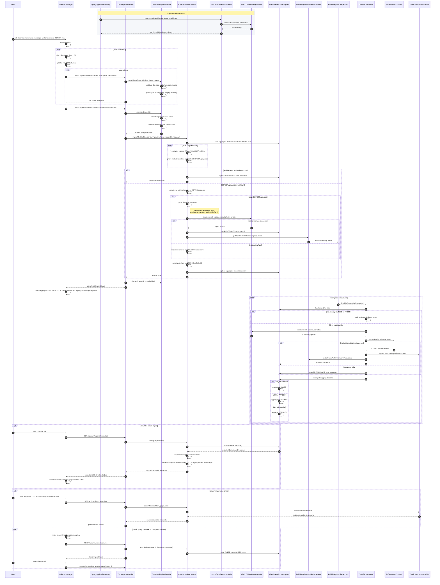

# CNM Import Design

## Purpose

The Common Network Model (CNM) import application is the first application surface for RDF-based grid model intake. It supports Common Grid Model (CGM), Coordinated Security Analysis (CSA), and Capacity Calculation (CC) use cases across intra-day, day-ahead, and day-two timeframes.

The initial implementation focuses on import orchestration, metadata capture, and reusable module boundaries. Semantic graph validation, PowSyBl-backed IIDM transformation, CSA, and CC calculation flows are expected to build on this foundation.

Profile-aware RDF metadata extraction, profile JSON persistence, dynamic profile-content tables, and browser-side error logging are detailed in `RDF_METADATA_MGMT.md`. Event-driven IIDM transformation after profile parsing is detailed in `IIDM_TRANSFORMATION_DESIGN.md`. This CNM import design owns the intake and asynchronous processing lifecycle; `RDF_METADATA_MGMT.md` owns semantic metadata extraction and exploration; `IIDM_TRANSFORMATION_DESIGN.md` owns the downstream IIDM DTO projection and its document stores.

## Profile Sources

The application accepts RDF profile files aligned with the ENTSO-E application profile library. The profile repository organizes CGMES and NCP profile definitions into dedicated folders and publishes RDFS, SHACL, and profile metadata packages. Import code should treat these profile definitions as external contracts, not as hand-written business assumptions.

## Modules

- `data.cnm`: transport DTOs shared by GUI, service, and mock modules. Packages are separated into `common`, `cgmes`, and `ncp`.
- `data.iidm`: PowSyBl-based IIDM network wrappers, summaries, XIIDM helpers, and IIDM transform event contracts.
- `map.cnm.iidm`: CNM profile DTO to PowSyBl IIDM `Network` mapping.
- `srv.cnm.services`: Spring Boot REST service exposing CNM import APIs and OpenAPI documentation.
- `srv.iidm.transformer`: Spring Boot worker/API service that consumes IIDM transform requests and persists `iidm-profile-transforms` and `iidm-networks`.
- `mock.srv.cnm.services`: Spring Boot mock service with in-memory import data for GUI development.
- `gui.common`: Vue shared components for buttons, links, menus, dropdowns, and searchable/sortable/paginated tables.
- `gui.cnm.manager`: Vue application for RDF upload and import status visualization.

## Import Scope

The first import flow does not map raw XML/RDF directly into IIDM objects. The synchronous intake path stores raw payloads in object storage through `com.infra`, persists import/file metadata in the document store through `com.infra`, and publishes RabbitMQ processing events. RDF metadata extraction, CGMES/NCP profile classification, and profile-document persistence happen asynchronously after object storage succeeds.

Later semantic import stages should load RDF into a graph or intermediate model before mapping. Complex relationship resolution should use a two-pass pipeline:

1. Instantiate core objects and store them by mRID.
2. Resolve topology and associations using lookup maps.

Strategy-based mapping should be used when topology or profile metadata indicates different mapping behavior, such as bus-branch and node-breaker variants.

## Planned Change: Asynchronous Metadata Processing

The import flow is split into two consistency boundaries.

1. Durable intake boundary:
   - Accept chunked uploads.
   - Assemble and validate files.
   - Recursively expand ZIP and nested ZIP entries.
   - Store each RDF/XML payload in object storage.
   - Persist an import aggregate and one file row per stored object.
   - Publish one RabbitMQ processing event per stored file.
   - Return to the GUI after object storage and event publication, without waiting for RDF metadata extraction.

2. Processing boundary:
   - Consume file-processing events asynchronously.
   - Read the file payload from object storage.
   - Parse filename metadata and extract RDF metadata.
   - Persist searchable profile metadata in Elasticsearch.
   - Update the file row as `PARSED` or `FAILED`.
   - Recompute and persist the aggregate import state after every file update.

The aggregate import status should be extended from the current `INIT`, `STORED`, `FAILED` model to include `SUCCESS`.

- `INIT`: upload was accepted and import metadata is being initialized.
- `STORED`: all RDF/XML payloads for the import have been stored in object storage and processing events were published.
- `SUCCESS`: every file associated with the import has completed asynchronous processing successfully.
- `FAILED`: at least one file failed upload, object storage, event publication, or asynchronous processing.

`FAILED` is terminal and wins over partial success. If one file-processing event fails, the file is marked `FAILED`, the aggregate is marked `FAILED`, and remaining file processing may continue only to collect diagnostics and profile metadata for the files that can still complete.

## Implementation Plan

1. Update contracts:
   - Add `SUCCESS` to `ImportState`.
   - Keep `ImportFileState` as `INIT`, `STORED`, `PARSED`, and `FAILED`.
   - Add a file-processing event DTO with `importId`, `fileId`, `objectId`, `fileName`, `serviceType`, `timeFrame`, retry count, and event timestamp.

2. Refactor synchronous import:
   - Keep chunk assembly and ZIP expansion in the REST request path.
   - Store raw RDF/XML payloads in object storage.
   - Persist the aggregate as `STORED` once every discovered payload is stored and every corresponding event is published.
   - Do not extract RDF metadata or persist `cnm-profiles` documents in the REST request thread.

3. Add asynchronous processor:
   - Add a RabbitMQ listener in `srv.cnm.services` or a separate worker module when deployment separation is needed.
   - The listener reads object bytes from object storage, extracts RDF metadata, persists `cnm-profiles`, and updates the file state.
   - Use idempotent updates keyed by `importId` and `fileId` so event redelivery is safe.

4. Preserve consistency:
   - Publish events only after the file object and file row are durable.
   - Treat event publication failure as an import failure because processing cannot be guaranteed.
   - Recompute aggregate state transactionally at the document boundary after each file update:
     - any file `FAILED` -> aggregate `FAILED`
     - all files `PARSED` -> aggregate `SUCCESS`
     - otherwise aggregate remains `STORED` or `INIT`
   - Store error messages on the failed file row and aggregate message.

5. Update APIs and GUI:
   - The existing list/detail APIs continue returning aggregate and file status.
   - GUI tables display `SUCCESS` as the final successful aggregate state.
   - The file-detail view shows individual files progressing from `STORED` to `PARSED` or `FAILED`.

6. Update tests:
   - Verify REST import returns after object storage and event publication.
   - Verify no profile documents are written synchronously.
   - Verify successful event processing creates profile documents and moves aggregate to `SUCCESS`.
   - Verify one failed file-processing event moves aggregate to `FAILED`.
   - Verify duplicate event delivery is idempotent.

## REST Surface

The production service owns the OpenAPI contract under `srv.cnm.services/src/main/resources/openapi/cnm-services.yaml`.

Initial endpoints:

- `POST /api/cnm/imports`: accepts service type, timeframe, optional message, and RDF profile file.
- `POST /api/cnm/imports/failures`: records an upload rejected by a proxy, network, or multipart boundary.
- `GET /api/cnm/imports`: returns import status rows with optional free-text filtering.
- `GET /api/cnm/imports/{importId}`: returns a single import status.
- `PUT /api/cnm/imports/{importId}/files/{fileId}/status`: accepts controlled file-state updates from trusted processors. The primary metadata-processing path is the RabbitMQ file-processing event consumer.

Messaging contracts:

- `cnm.file.processing.requested`: emitted once per stored RDF/XML object. The payload identifies the import, file, object-store key, service type, timeframe, and retry metadata.
- `cnm.file.processing.completed`: optional internal event emitted by a processor after profile metadata is persisted and the file row is marked `PARSED`.
- `cnm.file.processing.failed`: optional internal event emitted when a processor marks a file as `FAILED`.

Only `cnm.file.processing.requested` is required for the first asynchronous design. Completion and failure can be represented directly through document updates when the worker lives in `srv.cnm.services`.

The mock service follows the same route shape for GUI development.

## Sequence


```mermaid
sequenceDiagram
    autonumber
    participant User as "User"
    participant GUI as "gui.cnm.manager"
    participant Boot as "Spring application startup"
    participant API as "CnmImportController"
    participant Chunks as "CnmChunkUploadService"
    participant Import as "CnmImportRestService"
    participant Infra as "com.infra InfrastructureUtils"
    participant MinIO as "MinIO ObjectStorageService"
    participant Imports as "Elasticsearch cnm-imports"
    participant Events as "RabbitMQ EventPublisherService"
    participant Queue as "RabbitMQ cnm.file.process"
    participant Worker as "CNM file processor"
    participant RDF as "RdfMetadataExtractor"
    participant Profiles as "Elasticsearch cnm-profiles"

    rect rgb(245, 247, 250)
        Note over Boot,MinIO: Application initialization
        Boot->>Infra: create configured infrastructure capabilities
        Infra->>MinIO: initializeBucket(cnm-rdf-models)
        MinIO-->>Infra: bucket ready
        Infra-->>Boot: service initialization continues
    end

    User->>GUI: select service, timeframe, message, and one or more RDF/ZIP files
    GUI->>GUI: create import ID

    loop each source file
        GUI->>GUI: reject files larger than 1 GB
        GUI->>GUI: split file into 8 MB chunks
        loop each chunk
            GUI->>API: POST /api/cnm/imports/chunks with upload coordinates
            API->>Chunks: storeChunk(importId, fileId, index, bytes)
            Chunks->>Chunks: validate IDs, size, and chunk coordinates
            Chunks->>Chunks: persist part in temporary staging directory
            API-->>GUI: 200 chunk accepted
        end
    end

    GUI->>API: POST /api/cnm/imports/chunks/complete with message
    API->>Chunks: complete(importId)
    Chunks->>Chunks: assemble parts in index order
    Chunks->>Chunks: validate every part and final file size
    Chunks-->>API: staged MultipartFile list
    API->>Import: importModels(files, serviceType, timeframe, importId, message)
    Import->>Imports: save aggregate INIT document and INIT file rows

    loop each staged source
        Import->>Import: recursively expand ZIP and nested ZIP entries
        Import->>Import: ignore metadata entries and collect RDF/XML payloads
    end

    alt no RDF/XML payload was found
        Import->>Imports: replace import with FAILED document
        Import-->>API: FAILED ImportStatus
    else RDF/XML payloads were found
        Import->>Import: create one worker thread per RDF/XML payload
        par each RDF/XML payload
            Import->>Import: parse filename metadata
            Note right of Import: timestamp, timeframe, TSO,<br/>profile type, version, and profile family
            Import->>MinIO: store(cnm-rdf-models, importId/path, bytes)
            alt object storage succeeds
                MinIO-->>Import: object stored
                Import->>Imports: mark file STORED with objectId
                Import->>Events: publish CnmFileProcessingRequested
                Events->>Queue: route processing event
            else processing fails
                Import->>Import: capture exception as FAILED file document
            end
        end

        Import->>Import: aggregate state as STORED or FAILED
        Import->>Imports: replace aggregate import document
        Import-->>API: ImportStatus
    end

    API->>Chunks: discard(importId) in finally block
    API-->>GUI: completed ImportStatus
    GUI->>GUI: show aggregate INIT, STORED, or FAILED state until async processing completes

    loop each processing event
        Queue-->>Worker: CnmFileProcessingRequested
        Worker->>Imports: load import/file state
        alt file already PARSED or FAILED
            Worker->>Worker: acknowledge duplicate event
        else file is processable
            Worker->>MinIO: read(cnm-rdf-models, objectId)
            MinIO-->>Worker: RDF/XML payload
            Worker->>RDF: extract RDF profile references
            alt metadata extraction succeeds
                RDF-->>Worker: CGMES/NCP metadata
                Worker->>Profiles: upsert searchable profile document
                Worker->>Events: publish IidmProfileTransformRequested
                Worker->>Imports: mark file PARSED
            else extraction fails
                Worker->>Imports: mark file FAILED with error message
            end
            Worker->>Imports: recompute aggregate state
            alt any file FAILED
                Imports->>Imports: aggregate FAILED
            else all files PARSED
                Imports->>Imports: aggregate SUCCESS
            else files still pending
                Imports->>Imports: aggregate STORED
            end
        end
    end

    opt view files for an import
        User->>GUI: select the File link
        GUI->>API: GET /api/cnm/imports/{importId}
        API->>Import: findImport(importId)
        Import->>Imports: findByField(id, importId)
        Imports-->>Import: persisted CnmImportDocument
        Import->>Import: restore missing filename metadata
        Import->>Import: normalize epoch, numeric-string, ISO, or legacy Instant timestamps
        Import-->>API: ImportStatus with file details
        API-->>GUI: import and file-level metadata
        GUI->>GUI: show searchable, sortable, paginated file table
    end

    opt search imported profiles
        User->>GUI: filter by profile, TSO, business day, or business time
        GUI->>API: GET /api/cnm/imports/profiles
        API->>Import: searchProfiles(filters, page, size)
        Import->>Profiles: filtered document search
        Profiles-->>Import: matching profile documents
        Import-->>API: paginated profile metadata
        API-->>GUI: profile search results
    end

    opt chunk, proxy, network, or completion failure
        GUI->>GUI: retain import ID and expose re-upload
        GUI->>API: POST /api/cnm/imports/failures
        API->>Import: reportFailure(importId, file names, message)
        Import->>Imports: save FAILED import and file rows
        API-->>GUI: failed ImportStatus
        User->>GUI: select Re-upload
        GUI->>API: repeat chunk upload with the same import ID
    end
```

## Large Uploads And Retry

The GUI splits each source file into 8 MB binary chunks and supports a logical
file size of up to 1 GB. Nginx and Spring use a 16 MB per-request limit. The
service stages chunks on disk, validates completeness and size, then starts the
existing ZIP/RDF import pipeline.

The GUI creates the import ID before sending the multipart request. If a proxy or network error prevents the multipart request from reaching the service, the GUI sends a small failure report so the import still appears with `FAILED` status. Re-upload replaces that document under the same import ID, first with `INIT` and then with the completed or failed per-file state.

The aggregate import table intentionally omits profile columns because one
source bundle can contain multiple profiles. Its File column links to a
dedicated detail view using the same shared table behavior. Object-storage
intake completes as `STORED`; asynchronous processing later moves the aggregate
to `SUCCESS` when every file is `PARSED`, or to `FAILED` when any file fails.
The aggregate states are `INIT`, `STORED`, `SUCCESS`, and `FAILED`. The optional
message entered beside the RDF model selector is stored on `ImportStatus`.

File lifecycle is intentionally separate. `ImportFileState` contains `INIT`,
`STORED`, `PARSED`, and `FAILED`. File `STORED` means the object exists in
object storage and a processing event has been published. File `PARSED` means
the asynchronous processor extracted metadata and persisted the profile
document. A parsed file does not add `PARSED` to the aggregate lifecycle; all
files parsed yields aggregate `SUCCESS`, while any failed file yields aggregate
`FAILED`.

The filename pattern
`<Timestamp>_<Time Frame>_<TSO Name>_<Profile Type>_<Version>` populates both
the import-file document and profile document. The literal profile code,
derived profile family, and file state are separate fields. New persisted
timestamps are epoch milliseconds. Document fields are read schema-tolerantly,
then numeric, numeric-string, ISO, and legacy `Instant` values are normalized
to API `Instant` values when responses are assembled. Missing business day and
business time values are reconstructed from the filename.

Filename metadata is authoritative for profile type, TSO, timeframe, version,
business day, and business time. For example,
`20241202T2330Z_1D_TSO-XYZ_SV_002.xml` is stored as profile `SV`, business day
`2024-12-02`, and business time `23:30`.

After successful object storage, the service publishes file-processing events
through `com.infra` and returns the import as `STORED`. The asynchronous
processor stores profile metadata in the `cnm-profiles` Elasticsearch index.
Large typed profile JSON is stored separately in `cnm-profile-payloads` by
`fileId`. The profile search API filters by profile type, TSO, business day,
and business time without loading payload fields.

Profile-content table APIs load the payload document only when a user opens a
specific file. See `RDF_METADATA_MGMT.md` for the DTO, JSON mapping, dynamic
table, and GUI logging design.

The GUI `IIDM` menu is downstream of profile parsing. It lists lightweight IIDM
transform metadata from `srv.iidm.transformer`; it does not load XIIDM payloads
or all network details. When the user selects one completed transformed
profile/file, the GUI loads IIDM table metadata first and then requests rows for
only the selected table/page. See `IIDM_TRANSFORMATION_DESIGN.md` for the
document ownership and lazy table endpoints.

## Consistency Rules

- Object storage is the durable source for raw RDF/XML payloads.
- A file-processing event is published only after the object and file row are persisted.
- Event publication failure marks the file and aggregate as `FAILED`, because the asynchronous processor cannot be guaranteed to run.
- Event consumers are idempotent. Reprocessing an event for an already `PARSED` or `FAILED` file must acknowledge the event without duplicating profile documents.
- Profile documents are upserted using stable identifiers derived from `importId` and `fileId`.
- Aggregate recomputation happens after every file update:
  - any file `FAILED` -> aggregate `FAILED`
  - all files `PARSED` -> aggregate `SUCCESS`
  - otherwise aggregate remains `STORED` after object intake
- If an import has zero RDF/XML payloads, the aggregate is immediately `FAILED`.
  This is an intake failure, not an asynchronous processing failure.

## Dependency Rules

- `srv.cnm.services` invokes object and document storage only through `com.infra`.
- `srv.cnm.services` consumes `data.cnm` DTOs and does not depend on GUI or mock modules.
- `mock.srv.cnm.services` consumes `data.cnm` and `com.utils`, but not production infrastructure.
- `gui.cnm.manager` consumes `gui.common` and calls REST APIs over HTTP.
- `data.cnm` remains independent of Spring, PowSyBl, Elasticsearch, MinIO, RabbitMQ, and Vue.

## Local Deployment

The local Docker Compose stack can run infrastructure, the CNM service, the mock service, and the Vue manager from locally built artifacts.

```bash
mvn -Dmaven.repo.local=work/m2 -Ddocker.skip.build=true -Ddocker.skip.push=true clean package
docker compose -f docker/docker-compose.yml up
```

The production CNM service expects Elasticsearch, MinIO, RabbitMQ, and OpenTelemetry endpoint configuration through environment-specific YAML and container environment variables. The mock service can run without infrastructure.
