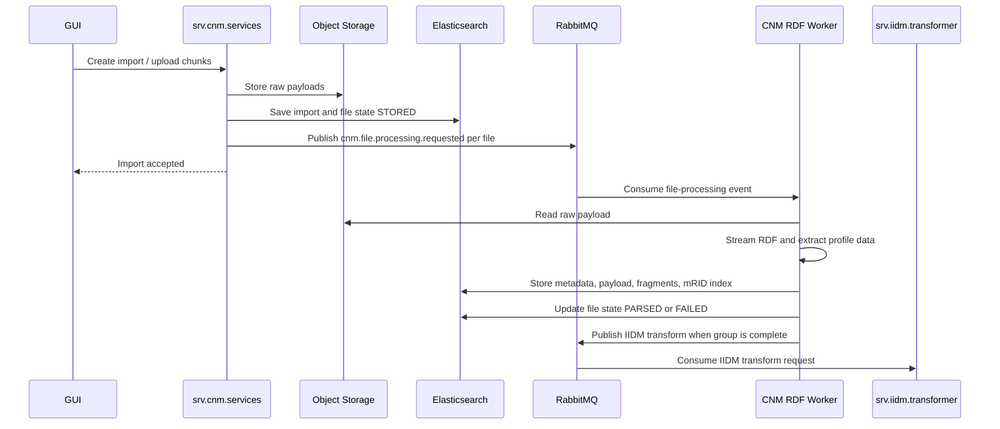

# CNM Import Design

CNM import is the intake path for RDF-based CGMES and NCP model files. It stores
raw source data durably, exposes import status to the GUI, processes RDF metadata
asynchronously, and publishes downstream IIDM transform requests when a complete
model group is ready.

## Modules

- `data.cnm`: import, profile, topology, snapshot, and dynamic table DTOs.
- `srv.cnm.services`: import REST API, chunk upload handling, object storage,
  RDF processing, document persistence, and event publication.
- `mock.srv.cnm.services`: in-memory CNM API for frontend work.
- `gui.cnm.manager`: standalone CNM manager UI.
- `gui.rcc.manager`: embeds the CNM manager view under CGM > Import Manager.
- `gui.common`: reusable table, refresh, theme, and logging components.

IIDM conversion is downstream and owned by `srv.iidm.transformer`; see
`IIDM_TRANSFORMATION_DESIGN.md`.

## Accepted Input

The upload API accepts individual RDF/XML or `.idm` files, ZIP files containing
multiple RDF/XML entries, and multiple ZIP files. The GUI sends large files as
bounded chunks so uploads up to 1 GB do not become a single oversized HTTP
request.

Model filenames provide import metadata. Standard model files use:

```text
<Timestamp>_<TimeFrame>_<TSO>_<ProfileType>_<Version>
```

Boundary files use the ENTSO-E boundary style:

```text
<Timestamp>__<Authority>_<EQBD|EQ_BD|TPBD|TP_BD>_<Version>
```

The service derives business day, business time, timeframe, TSO/authority,
profile type, profile family, and version from the filename. RDF metadata is
also inspected to confirm profile information.

## Import State

The import aggregate uses `ImportState`:

- `INIT`: import has been created or is being assembled.
- `STORED`: raw files are stored and processing events are queued.
- `SUCCESS`: every file in the import has been parsed successfully.
- `FAILED`: one or more files failed intake or processing.

Each file uses `ImportFileState`:

- `INIT`
- `STORED`
- `PARSED`
- `FAILED`

The aggregate state is derived from file states. A failed file makes the import
`FAILED`; all parsed files make it `SUCCESS`.

## Storage Ownership

`srv.cnm.services` owns these Elasticsearch indices:

- `cnm-imports`: aggregate import document and per-file metadata.
- `cnm-profiles`: searchable lightweight profile metadata.
- `cnm-profile-payloads`: large profile JSON payloads, stored separately from
  search/list metadata.
- `cnm-profile-fragments`: compact RDF fragments used for snapshot assembly.
- `cnm-mrid-index`: mRID lookup rows.
- `cnm-network-snapshots`: snapshot metadata.
- `cnm-network-snapshot-payloads`: chunked snapshot payload sections.

Raw RDF/XML and ZIP entries are stored in MinIO through
`com.infra.storage.object`.

## Event Flow


```mermaid
sequenceDiagram
  participant GUI as GUI
  participant CNM as srv.cnm.services
  participant MinIO as Object Storage
  participant ES as Elasticsearch
  participant MQ as RabbitMQ
  participant Worker as CNM RDF Worker
  participant IIDM as srv.iidm.transformer

  GUI->>CNM: Create import / upload chunks
  CNM->>MinIO: Store raw payloads
  CNM->>ES: Save import and file state STORED
  CNM->>MQ: Publish cnm.file.processing.requested per file
  CNM-->>GUI: Import accepted
  MQ->>Worker: Consume file-processing event
  Worker->>MinIO: Read raw payload
  Worker->>Worker: Stream RDF and extract profile data
  Worker->>ES: Store metadata, payload, fragments, mRID index
  Worker->>ES: Update file state PARSED or FAILED
  Worker->>MQ: Publish IIDM transform when group is complete
  MQ->>IIDM: Consume IIDM transform request
```

## Grouping Rules

RDF files are processed with a `ProfileProcessingContext` containing import ID,
file ID, object ID, TSO, business day, business time, timeframe, profile family,
and profile type. Processing is serialized per import, TSO, business day,
business time, and timeframe so cross-referenced EQ, TP, SSH, and SV files are
handled against a stable import state.

Boundary profiles (`EQ_BD`, `TP_BD`) are parsed as CGMES profiles and included
as support files in IIDM transform requests for every completed model group.

## GUI Behavior

The import screen shows aggregate imports. The File link opens file-level
status and profile metadata. The Profiles tab lists successful imports in a
dropdown and displays profile metadata and profile JSON tables for the selected
file. The IIDM tab lists successful imports and transformed IIDM networks through
the IIDM transformer APIs.

Refresh behavior is controlled by the shared `AutoRefreshControl` in
`gui.common`.
