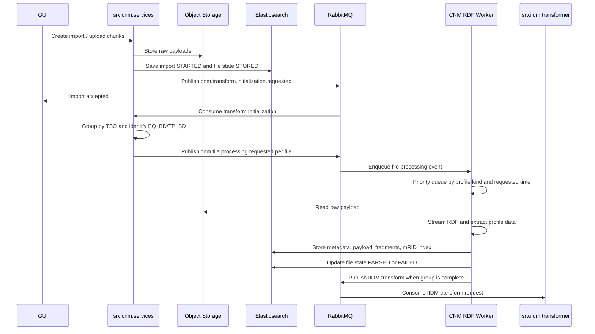

# CNM Import Design

CNM import is the intake path for RDF-based CGMES and NCP model files. It stores
raw source data durably, exposes import status to the GUI, processes RDF metadata
asynchronously, and publishes downstream IIDM transform requests when a complete
model group is ready.

## Modules

- `data.cnm`: import, profile, topology, snapshot, and dynamic table DTOs.
- `srv.cnm.services`: import REST API, chunk upload handling, object storage,
  RDF processing, document persistence, and event publication.
- `mock.srv.cnm.services`: in-memory CNM API for frontend work.
- `gui.cnm.manager`: standalone CNM manager UI.
- `gui.rcc.manager`: embeds the CNM manager view under CGM > Import Manager.
- `gui.common`: reusable table, refresh, theme, and logging components.

IIDM conversion is downstream and owned by `srv.iidm.transformer`; see
`IIDM_TRANSFORMATION_DESIGN.md`.

## Accepted Input

The upload API accepts individual RDF/XML or `.idm` files, ZIP files containing
multiple RDF/XML entries, and multiple ZIP files. The GUI sends large files as
bounded chunks so uploads up to 1 GB do not become a single oversized HTTP
request.

Model filenames provide import metadata. Standard model files use:

```text
<Timestamp>_<TimeFrame>_<TSO>_<ProfileType>_<Version>
```

Boundary files use the ENTSO-E boundary style:

```text
<Timestamp>__<Authority>_<EQBD|EQ_BD|TPBD|TP_BD>_<Version>
```

Profiles that do not carry a model timeframe in the filename, including
geographical layout files, use the same double-underscore shape:

```text
<Timestamp>__<TSO>_<ProfileType>_<Version>
```

The importer strips chained transport/data extensions such as `.xml.zip` before
parsing metadata. When the filename omits the timeframe, the file-level model
timeframe falls back to the timeframe selected for the import request.

The service derives business day, business time, timeframe, TSO/authority,
profile type, profile family, and version from the filename. RDF metadata is
also inspected to confirm profile information.

Import documents use explicit Elasticsearch mappings for searchable enum,
identifier, and timestamp fields. `createdAt` and file `uploadedAt` are stored
as epoch-millisecond `long` values so import listing can sort consistently.

## Import State

The import aggregate uses `ImportState`:

- `INIT`: import has been created or is being assembled.
- `STARTED`: raw files are stored and transform initialization is queued.
- `IN_PROGRESS`: transform initialization has grouped files and RDF metadata
  work is running.
- `SUCCESS`: every file in the import has been parsed successfully.
- `FAILED`: one or more files failed intake or processing.

Each file uses `ImportFileState`:

- `INIT`
- `STORED`
- `PARSED`
- `FAILED`

The aggregate state is derived from file states. A failed file makes the import
`FAILED`; all parsed files make it `SUCCESS`; otherwise stored or partially
parsed files make it `IN_PROGRESS`.

Each file also exposes aggregate IIDM transformation status. The status is
`NOT_STARTED`, `STARTED`, `DONE`, or `FAILED`, with a count of related IIDM
transforms. Any failed related transform makes the aggregate IIDM status
`FAILED`; all completed related transforms make it `DONE`.

## Storage Ownership

`srv.cnm.services` owns these Elasticsearch indices:

- `cnm-imports`: aggregate import document and per-file metadata.
- `cnm-profiles`: searchable lightweight profile metadata.
- `cnm-profile-payloads`: large profile JSON payloads, stored separately from
  search/list metadata.
- `cnm-profile-fragments`: compact RDF fragments used for snapshot assembly.
- `cnm-mrid-index`: mRID lookup rows.
- `cnm-network-snapshots`: snapshot metadata.
- `cnm-network-snapshot-payloads`: chunked snapshot payload sections.

Raw RDF/XML and ZIP entries are stored in MinIO through
`com.infra.storage.object`.

The service reads lightweight IIDM transform documents from the IIDM-owned
`iidm-profile-transforms` index to aggregate file-level IIDM status. It does
not own or mutate those IIDM documents.

## Event Flow


```mermaid
sequenceDiagram
  participant GUI as GUI
  participant CNM as srv.cnm.services
  participant MinIO as Object Storage
  participant ES as Elasticsearch
  participant MQ as RabbitMQ
  participant Worker as CNM RDF Worker
  participant IIDM as srv.iidm.transformer

  GUI->>CNM: Create import / upload chunks
  CNM->>MinIO: Store raw payloads
  CNM->>ES: Save import STARTED and file state STORED
  CNM->>MQ: Publish cnm.transform.initialization.requested
  CNM-->>GUI: Import accepted
  MQ->>CNM: Consume transform initialization
  CNM->>CNM: Group by TSO and identify EQ_BD/TP_BD
  CNM->>MQ: Publish cnm.file.processing.requested per file
  MQ->>Worker: Enqueue file-processing event
  Worker->>Worker: Priority queue by profile kind and requested time
  Worker->>MinIO: Read raw payload
  Worker->>Worker: Stream RDF and extract profile data
  Worker->>ES: Store metadata, payload, fragments, mRID index
  Worker->>ES: Update file state PARSED or FAILED
  Worker->>MQ: Publish IIDM transform when group is complete
  MQ->>IIDM: Consume IIDM transform request
```

CNM processing queues use three listener attempts. After retry exhaustion the
message is rejected without requeue and RabbitMQ routes it to the configured
DLQ.

## Recovery

Import read APIs are pure reads. `listImports` and `findImport` only load the
stored document and map it to DTOs; they do not publish retry events or mutate
state.

Stale asynchronous work is recovered by `CnmImportRecoveryService`, a scheduled
worker in `srv.cnm.services`. The worker scans recent non-terminal imports and
requeues missing work without changing the stored import document:

- `STARTED` imports with stale `STORED` files republish
  `cnm.transform.initialization.requested`.
- `IN_PROGRESS` imports with stale `STORED` files republish
  `cnm.file.processing.requested` for each stale file.
- `SUCCESS` and `FAILED` imports are ignored.

The scheduler is guarded against overlapping runs and throttles repeated
requeues per import/file key. Runtime behavior is configurable with
`cnm.import.recovery.enabled`, `fixed-delay-ms`, `stale-after-ms`,
`requeue-throttle-ms`, and `scan-limit`.

## Grouping Rules

Transform initialization loads the import file list, identifies common boundary
profiles, groups model files by TSO, business day, business time, and timeframe,
and publishes RDF metadata work. RDF work is accepted by the Rabbit listener and
processed through an in-memory priority queue. The comparator sorts first by
profile priority and then by request creation time:

1. `EQ_BD`
2. `TP_BD`
3. `EQ`
4. `TP`
5. `SSH`
6. `SV`
7. other known profiles
8. `UNKNOWN`

RDF files are processed with a `ProfileProcessingContext` containing import ID,
file ID, object ID, TSO, business day, business time, timeframe, profile family,
and profile type. Existing profile metadata for the same import/file pair is
treated as already processed so replayed events and repeated boundary references
do not duplicate RDF extraction.

Boundary profiles (`EQ_BD`, `TP_BD`) are parsed as CGMES profiles and included
as support files in IIDM transform requests for every completed model group.

## GUI Behavior

The import screen shows aggregate imports. The File link opens file-level
status, profile metadata, IIDM aggregate status, and an IIDM link showing the
number of related transformations. The IIDM link opens the IIDM view for the
same import. The Profiles tab lists successful imports in a dropdown and
displays profile metadata and profile JSON tables for the selected file. The
IIDM tab lists successful imports and transformed IIDM networks through the IIDM
transformer APIs.

Refresh behavior is controlled by the shared `AutoRefreshControl` in
`gui.common`.
