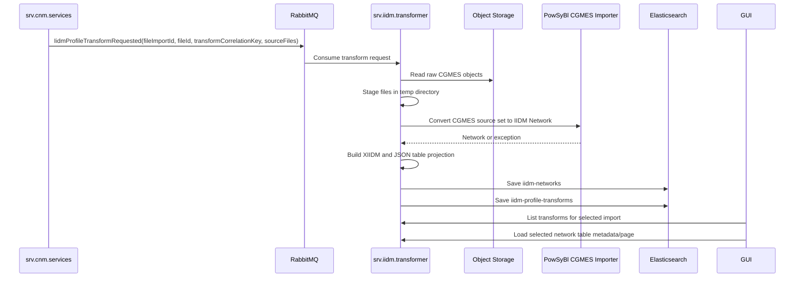

# IIDM Transformation Design

IIDM transformation is owned by `srv.iidm.transformer`. The service consumes
RabbitMQ transform requests emitted by CNM import, converts grouped raw CGMES
source files into PowSyBl IIDM networks, stores transform state, and exposes
lazy table APIs for the GUI.

## Modules

- `data.iidm`: transform events, diagnostics, source file references, transform
  state, PowSyBl network wrappers, summaries, and XIIDM helpers.
- `map.cnm.iidm`: PowSyBl conversion logic.
- `srv.iidm.transformer`: event consumer, staging, conversion, diagnostics,
  document persistence, and REST table APIs.
- `gui.cnm.manager` and `gui.rcc.manager`: IIDM exploration views.

## Transform Input

The preferred request is `IidmProfileTransformRequested` with `sourceFiles`.
Each source file contains file ID, filename, object ID, profile family, and
profile type. `srv.iidm.transformer` reads the raw objects from MinIO, stages
them in a temporary directory, and calls PowSyBl's CGMES importer through
`CgmesSourceToIidmTransformer`.

Boundary files (`EQ_BD`, `TP_BD`) are included in the same staged directory as
support files. This is required for IGM model groups whose equipment and
topology reference boundary data.

Transform documents persist source file IDs for correlation and source file
names for display. Network source-file tables use filenames as the visible
source reference.

Compatibility paths remain available for older events that reference profile
payload IDs or CNM snapshot IDs.

## Persistence

`srv.iidm.transformer` owns two document groups:

- `iidm-profile-transforms`: transform state, message, diagnostics,
  source-profile linkage, source file IDs/names, timestamps, and IIDM network
  ID.
- `iidm-networks`: IIDM network metadata, source filenames, element counts,
  XIIDM payload, and GUI-oriented JSON table projection.

XIIDM remains the canonical PowSyBl interchange representation. The JSON
projection is stored to render GUI tables without reconstructing a PowSyBl
network for every selected table.

Large XIIDM and JSON payloads are chunked when needed. List APIs exclude heavy
payload fields.

## Diagnostics

Transform diagnostics include:

- transformer-provided informational messages
- root exception type and message for failed transforms
- bounded PowSyBl CGMES WARN/ERROR messages captured during conversion
- warning/error count summaries

If PowSyBl returns a network with warnings, the transform is `DONE` and
diagnostics are retained. If no usable network is returned, the transform is
`FAILED`.

## API Shape

The service exposes:

- transform summaries, filtered by import and search text
- network summaries without heavy payload fields
- table metadata for a network
- one selected table page at a time

Search and paging are applied before the GUI receives table rows so large IIDM
networks are not loaded into the browser at once.

The IIDM request queue uses three listener attempts. After retry exhaustion the
message is rejected without requeue and RabbitMQ routes it to the configured
DLQ.

## Flow

