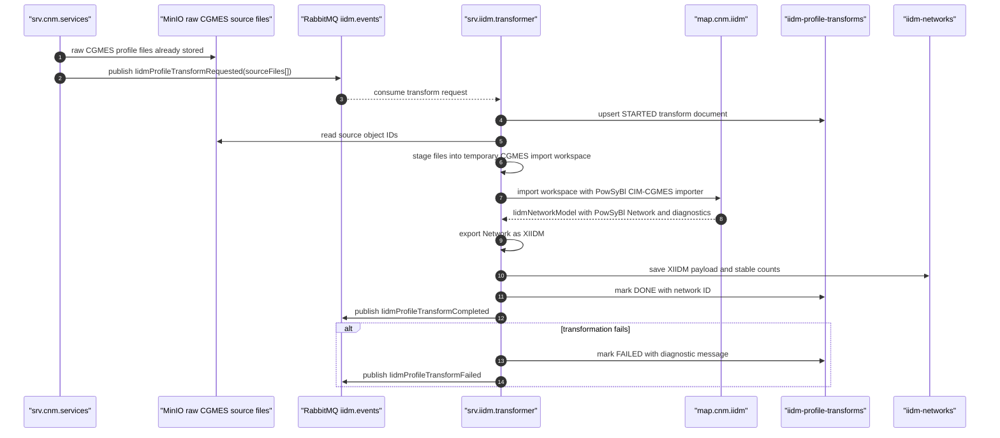

# IIDM Transformation Design

## Purpose

IIDM transformation starts after CNM RDF metadata extraction has confirmed that
all files in a TSO/business day/business time/timeframe group are parsed. The
preferred source is the original CGMES source file set stored in object storage.
`srv.iidm.transformer` stages those files and delegates CGMES-to-IIDM conversion
to PowSyBl's native CIM-CGMES importer, which loads RDF/XML into its RDF4J
triplestore and creates a PowSyBl IIDM `Network`.

Persisted CNM DTOs and stitched `CgmNetworkSnapshot` payloads remain available
for exploration, diagnostics, and compatibility fallback, but they are not the
primary IIDM conversion source. The PowSyBl dependency is intentionally owned by
`data.iidm` and `map.cnm.iidm` so load-flow, security-analysis, and RAO services
can consume real IIDM networks without importing CGMES parsing logic.

## Module Ownership

- `data.iidm`: owns PowSyBl IIDM network wrappers, XIIDM helpers, transform
  state, and transform event contracts. It is the explicit module where
  `com.powsybl.*` dependencies are allowed.
- `map.cnm.iidm`: owns direct CGMES source-file to PowSyBl IIDM `Network`
  transformation and the compatibility CNM DTO to IIDM mapper. It depends on
  `data.cnm`, `data.iidm`, and `com.mapping`.
- `srv.iidm.transformer`: owns RabbitMQ event consumption, CNM profile payload
  compatibility reads, raw object staging, IIDM transform status persistence,
  IIDM network persistence, and IIDM REST exploration APIs.
- `srv.cnm.services`: owns CNM import, RDF metadata extraction, and asynchronous
  snapshot assembly. After every file in a model group is parsed, it publishes a
  grouped IIDM transform request containing all raw object IDs for that model
  group. Snapshot-level events remain as compatibility diagnostics.
- `com.infra`: owns document storage and messaging adapters.
- `com.mapping`: owns DTO-to-JSON and JSON-to-DTO conversion contracts.

`srv.cnm.services` must not depend on `map.cnm.iidm` or `srv.iidm.transformer`.
The hand-off between CNM and IIDM is an event using `data.iidm` contracts. GUI
modules and `data.cnm` remain free of PowSyBl dependencies.

The CNM service declares the IIDM event exchange as an additional messaging
exchange because the snapshot worker publishes
`IidmProfileTransformRequested` independently of the IIDM transformer consumer
startup.

## Document Ownership

CNM document indices:

- `cnm-imports`: import aggregate and file processing status.
- `cnm-profiles`: searchable profile metadata only.
- `cnm-profile-payloads`: large profile DTO JSON payloads keyed by `fileId`.
- `cnm-profile-fragments`: compact per-file RDF fact JSON.
- `cnm-mrid-index`: cross-profile mRID index rows.
- `cnm-network-snapshots`: stitched model snapshot metadata by
  import/TSO/business day/business time/timeframe.
- `cnm-network-snapshot-payloads`: sectioned stitched model JSON payloads keyed
  by snapshot ID. IIDM transformation reconstructs a snapshot from these
  sections only when snapshot metadata is `DONE`.

IIDM document indices:

- `iidm-profile-transforms`: one transform status document per direct CGMES
  source group or compatibility source. It records the transform state,
  diagnostics, and the resulting IIDM network ID.
- `iidm-networks`: PowSyBl IIDM networks exported in XIIDM format and keyed by
  network ID. Searchable fields contain import ID, source file IDs, TSO,
  timeframe, business day, business time, and stable element counts.

Large payload fields remain XIIDM text or chunks. Search and list APIs should
query stable metadata fields and should not read the XIIDM payload unless the
caller requests a concrete network.

## GUI Visualization

The `IIDM` menu in `gui.cnm.manager` is completed-snapshot scoped and
lazy-loaded:

- The initial view first requires selecting a completed CNM snapshot. The
  selector contains only `cnm-network-snapshots` rows whose state is `DONE`.
- After selection, the view calls the transform list API with the snapshot
  import ID and keeps rows linked to the selected snapshot ID. It receives
  transform/network metadata only. It does not receive `networkXiidm` or
  `networkXiidmChunks`.
- Rows are clickable only when the transform state is `DONE` and a network ID is
  available.
- Selecting one transformed profile opens an IIDM detail view for that network.
- The first detail request returns table metadata only: table IDs, labels,
  columns, and total row counts.
- Rows are fetched with a second request for the selected table and page.
- `srv.iidm.transformer` reads the stored XIIDM network only for the selected
  table request, and converts only that table family into rows.

This keeps large IIDM networks out of browser memory and avoids expanding all
network objects merely to show the list or table selector.

## Event Flow

## Mapping Rules

The preferred implementation uses PowSyBl's native CIM-CGMES importer:

- input CGMES RDF/XML files are loaded into PowSyBl's RDF4J triplestore.
- the complete EQ/TP/SSH/SV model group is converted as one source set.
- node/breaker and bus/branch topology are handled by PowSyBl.
- CGMES terminal aliases, boundaries, control areas, SV injections, subnetworks,
  and naming behavior are governed by PowSyBl import parameters.

PowSyBl import defaults are loaded from cached YAML configuration under
`srv.iidm.transformer/src/main/resources/config/profile/iidm`. Supported
properties include `iidm.import.cgmes.*` options such as SV injection
conversion, ID source, triplestore implementation, subnetworks, boundary
behavior, node/breaker conversion, and busbar-section creation. These values
must not be hard-coded in service logic, so parallel transform workers use the
same immutable in-memory configuration snapshot.

The transformer still supports the older profile-payload and snapshot event
paths as compatibility fallbacks. Direct source events are selected when the
event carries `sourceFiles[]` and no `sourceProfilePayloadId` or
`sourceSnapshotId`.

## REST Surface

`srv.iidm.transformer` exposes:

- `GET /api/iidm/transforms?importId={importId}&search={search}&page={page}&size={size}`:
  list lightweight profile transform status rows for IIDM menu screens. Search
  is applied against metadata fields such as file ID, profile, state, message,
  and network ID.
- `GET /api/iidm/transforms/{fileId}`: read one transform status by source file.
- `GET /api/iidm/networks?importId={importId}&page={page}&size={size}`: list
  lightweight IIDM network metadata for an import. The response excludes XIIDM
  payload fields.
- `GET /api/iidm/networks/{networkId}`: read one persisted IIDM network document.
- `GET /api/iidm/imports/{importId}/files/{fileId}/tables`: load table metadata
  for the selected transformed profile/file.
- `GET /api/iidm/networks/{networkId}/tables`: load table metadata for one
  selected transformed network.
- `GET /api/iidm/networks/{networkId}/tables/{tableId}?page={page}&size={size}&search={search}`:
  load one page of rows for the selected IIDM table.

The full network document endpoint is retained for service diagnostics. GUI code
uses the metadata and paged table endpoints. IIDM dynamic-table search is
server-side so a term can match rows beyond the currently displayed page.

## Consistency Rules

- CNM marks a file `PARSED` only after its profile metadata and profile payload
  are durable.
- IIDM transform status starts at `STARTED` when an event is consumed.
- IIDM transform status moves to `DONE` only after the IIDM network document is
  saved.
- IIDM transform status moves to `FAILED` if source payload retrieval, JSON
  mapping, PowSyBl network creation, XIIDM export, or network persistence fails.
- Transform event handling is idempotent by `fileId`: reprocessing replaces the
  transform document and network document for the same source file.
- Direct source transform events are idempotent by their grouped event `fileId`;
  the produced network ID is derived from the import ID and grouped model key.
- Snapshot transform events are retained for compatibility and are idempotent by
  `sourceSnapshotId`.
