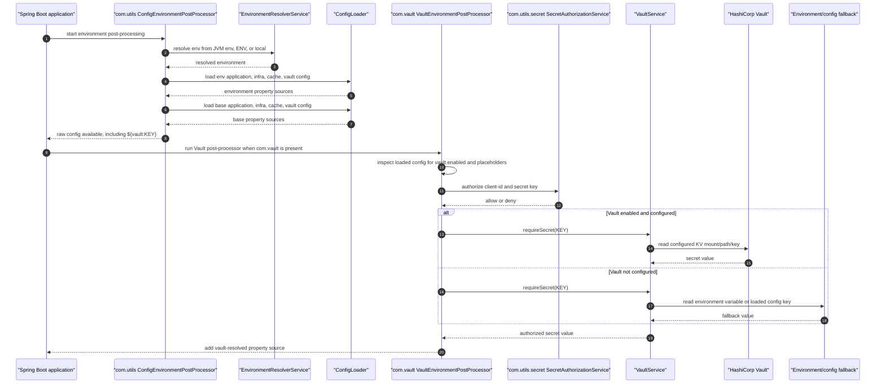

# Local Deployment And Environment Resolution

## Local Deployment Principle

Local deployment is intentionally built from the same artifacts used by CI and Docker publication:

1. Maven builds Java modules and frontend bundles.
2. Docker Compose starts infrastructure and application containers.
3. Runtime configuration is resolved from environment-specific module files.

The goal is that a developer can reproduce the application stack without manual service setup.

## Local Build

Build the application without Docker image work:

```bash
mvn -Dmaven.repo.local=work/m2 -Ddocker.skip.build=true -Ddocker.skip.push=true clean package
```

Run a focused module slice:

```bash
mvn -Dmaven.repo.local=work/m2 -Ddocker.skip.build=true -Ddocker.skip.push=true -pl com.infra -am test
```

## Docker Compose

Start the local stack:

```bash
docker compose -f docker/docker-compose.yml up
```

The stack includes shared dependencies such as Elasticsearch, MinIO, RabbitMQ, OpenTelemetry, and Keycloak where applicable. Application images are built from local Maven artifacts.

Current application ports:

- `srv.cnm.services`: `8080`
- `mock.srv.cnm.services`: `8084`
- `gui.cnm.manager`: `5173`
- `com.auth`: `8082`

## Docker Maven Lifecycle

Docker behavior is configured from root Maven properties:

```xml
<docker.registry>docker.io</docker.registry>
<docker.namespace>gsrinike</docker.namespace>
<docker.image.tag>${project.version}</docker.image.tag>
<docker.image.latest-tag>latest</docker.image.latest-tag>
<docker.skip.build>false</docker.skip.build>
<docker.skip.push>false</docker.skip.push>
<maven.deploy.skip>true</maven.deploy.skip>
```

Docker-enabled modules configure only their module-specific image name. The full image name is assembled consistently from root properties.

## Environment Resolution Principle

Environment selection is centralized in `com.utils.env`:

1. JVM system property `env`
2. Operating system environment variable `ENV`
3. Default value `local`

The resolved value is normalized and used by `com.utils.config`.

## Configuration Loading Order

`com.utils.config` loads module configuration in this property-source order:

1. `<env>/<module>-application.yml`
2. `<env>/<module>-infra.yml`
3. `<env>/<module>-cache-config.yml`
4. `<env>/<module>-vault.yml`
5. `base/<module>-application.yml`
6. `base/<module>-infra.yml`
7. `base/<module>-cache-config.yml`
8. `base/<module>-vault.yml`

Earlier property sources have higher precedence. This makes base configuration stable while allowing `local`, `prod`, `sate`, or other environments to override only changed values.

## Cache Configuration

Cache configuration follows the same environment principle through `<module>-cache-config.yml`.

Current cache providers:

- `java`: in-memory Java cache implementation.
- `none`: disables cache behavior.

Cache, environment, and application configuration loading details are owned by `com.utils`.

## Vault Secret Resolution

Configuration values can use `${vault:SECRET_KEY}` when the application includes `com.vault`. `com.utils` first resolves the runtime environment and loads module configuration for that environment. Then `com.vault` inspects the loaded application/vault properties. If Vault is enabled and fully configured there, it reads the secret from HashiCorp Vault. If Vault is not configured, resolution falls back to the matching environment variable and then to matching loaded configuration.

Before any value is returned, `com.vault` calls `com.utils.secret.SecretAuthorizationService`. This validates that the client whose configuration is being loaded is allowed to access the requested secret key, preventing an application from loading arbitrary configuration secrets merely by naming a key. This bootstrap policy avoids a dependency cycle: `com.vault` depends on `com.utils`, while `com.auth` remains independent of `com.vault`.

### Adding Vault Configuration

Add Vault connection and authorization policy in either `base/<module>-vault.yml` or `<env>/<module>-vault.yml`. Environment-specific files override base values.

```yaml
vault:
  enabled: true
  address: http://localhost:8200
  token: "${VAULT_TOKEN}"
  kv:
    mount: secret
    path: sample-app
    version: 2
  authorization:
    client-id: sample.app
    allowed-keys: APP_SECRET
```

The `vault.authorization.client-id` value must match the module/client being bootstrapped, usually the same value set through the `module` system property. The `vault.authorization.allowed-keys` list is the allowlist for `${vault:...}` references used by that client. A `*` value is supported for controlled local/test contexts, but explicit keys are preferred.

### Referencing Secrets In App Config

Reference secrets from application or infrastructure config with the `${vault:SECRET_KEY}` placeholder. For example, `base/<module>-infra.yml` can keep a credential as a reference rather than a committed value:

```yaml
utility:
  credentials:
    password: "${vault:APP_SECRET}"
```

Do not place the secret value itself in the app config. Store it in HashiCorp Vault under the configured KV mount/path, or provide it through the environment as a local fallback only.

### Resolution Sequence



## Module Requirements

Spring Boot applications should:

- Set `module` before `SpringApplication.run(...)`, or set `MODULE`.
- Include resources under `base`, `local`, and any supported runtime environment folders.
- Keep secrets outside committed files and provide them through environment variables or deployment configuration.

See:

- [com.utils README](../com.utils/README.md)
- [root README](../README.md)
