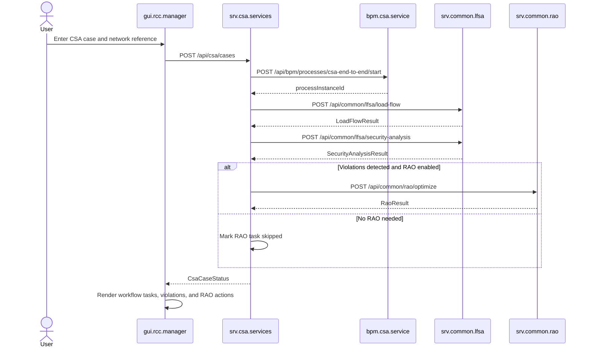
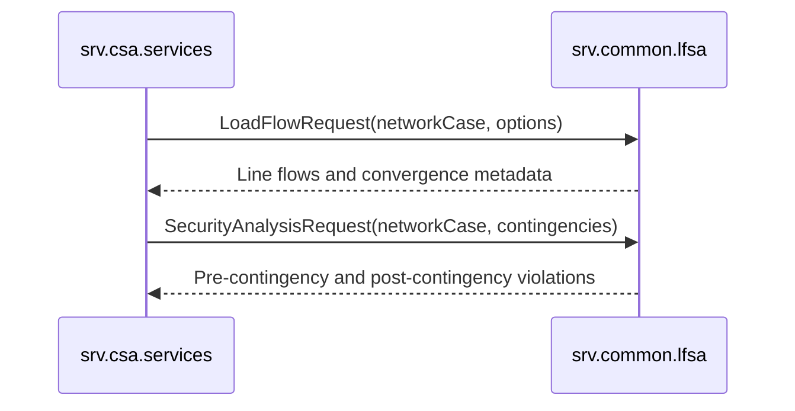
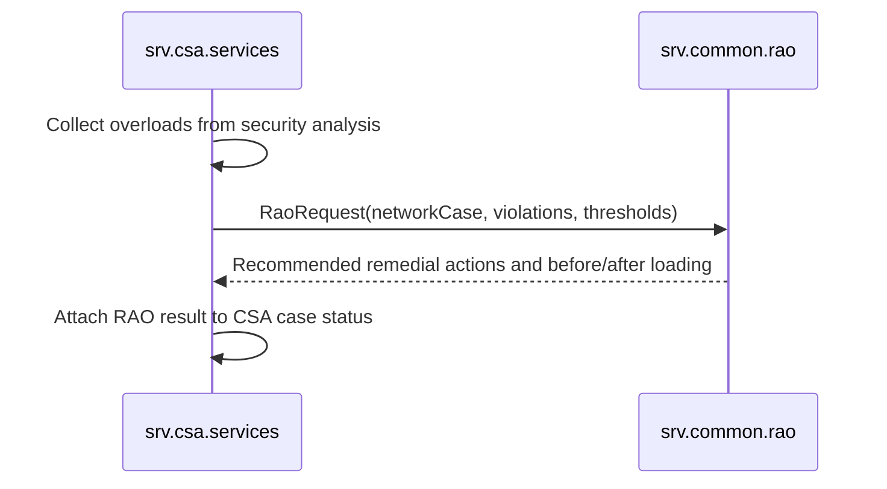
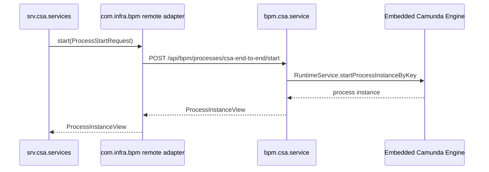
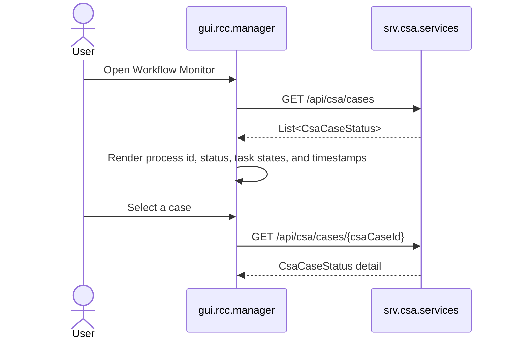
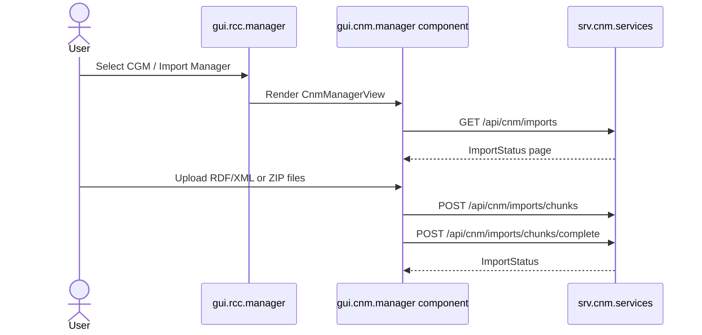

# RCC CSA Design

This document describes the first RCC capability increment: Coordinated Security Analysis (CSA). The module family is additive and does not move CNM import business logic.

## Module Boundaries

- `data.common`: transport DTOs shared by CSA, common LF/SA, common RAO, BPM, GUI, and mocks.
- `srv.common.lfsa`: common load-flow and security-analysis REST service.
- `mock.srv.common.lfsa`: mock LF/SA REST service for frontend and workflow development.
- `srv.common.rao`: common remedial-action optimization REST service.
- `mock.srv.common.rao`: mock RAO REST service for frontend and workflow development.
- `srv.csa.services`: CSA orchestration REST service. It starts CSA cases, calls LF/SA and RAO, and invokes BPM through `com.infra.bpm`.
- `mock.srv.csa.services`: mock CSA REST service aligned with the CSA OpenAPI contract.
- `bpm.csa.service`: Camunda-backed process host for the `csa-end-to-end` process.
- `gui.rcc.manager`: Vue RCC manager focused on CSA execution and workflow monitoring.

CSA uses network case references. CNM import remains responsible for RDF ingestion and network model metadata.

## CSA End-To-End

## Common LF/SA Flow

`srv.common.lfsa` is common by design. CSA, capacity calculation, and operational planning modules should reuse it instead of embedding load-flow or security-analysis logic in their own services.

## RAO Flow

`srv.common.rao` is shared because remedial-action optimization is needed by more than CSA.

## BPM Interaction

`srv.csa.services` has no Maven dependency on `bpm.csa.service`. The process module can be deployed separately and replaced without changing CSA service code, as long as it preserves the process-neutral BPM REST shape.

## Workflow Monitor

## CGM Import Manager Entry

The RCC GUI exposes CGM above CSA, CC, and OPC. The CGM / Import Manager entry embeds the CNM manager screens and preserves the existing CNM backend integration. Runtime frontend configuration keeps the CSA and CNM API base URLs separate so each environment can route `/api/csa/**` and `/api/cnm/**` independently.

CSA and Workflow Monitor remain active RCC items. CC and OPC remain disabled placeholders until their service modules are introduced.

## Local Ports

- `srv.common.lfsa`: `8091`
- `mock.srv.common.lfsa`: `8092`
- `srv.common.rao`: `8093`
- `mock.srv.common.rao`: `8094`
- `srv.csa.services`: `8095`
- `mock.srv.csa.services`: `8096`
- `bpm.csa.service`: `8097`
- `gui.rcc.manager`: `5174`
