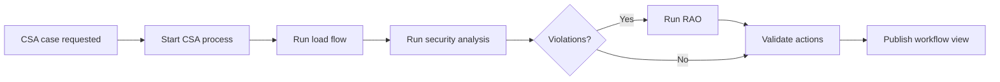

# RCC CSA Design

The RCC module family provides the current Regional Coordination Centre user
surface. It includes CGM import navigation, CSA orchestration, workflow
monitoring, and placeholders for future CC and OPC capabilities.

## Module Ownership

- `data.common`: DTOs for network case references, load-flow requests/results,
  security-analysis requests/results, RAO requests/results, CSA status, and
  workflow views.
- `srv.common.lfsa`: reusable load-flow and security-analysis REST boundary.
- `srv.common.rao`: reusable remedial-action optimization REST boundary.
- `srv.csa.services`: CSA orchestration service that coordinates common
  services and starts BPM through `com.infra`.
- `bpm.csa.service`: Camunda runtime that owns the `csa-end-to-end` process.
- `gui.rcc.manager`: Vue RCC manager UI.
- `mock.srv.*`: in-memory service alternatives for frontend and orchestration
  development.

## CSA Flow

## Service Boundaries

Load flow, security analysis, and RAO are not embedded in CSA. They are common
services because CSA, capacity calculation, and operational planning can reuse
the same contracts.

CSA orchestration does not import `bpm.csa.service`. It starts and observes
workflow instances through the generic BPM contract in `com.infra` or through a
remote BPM endpoint.

## GUI

`gui.rcc.manager` has a sidebar with CGM, CSA, CC, OPC, and workflow monitoring.
CGM > Import Manager renders the CNM manager view while preserving configurable
CNM and IIDM backend URLs. CSA screens use the CSA/common service APIs. CC and
OPC are shown as inactive placeholders until their services are introduced.
