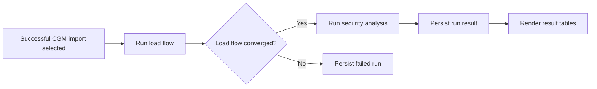
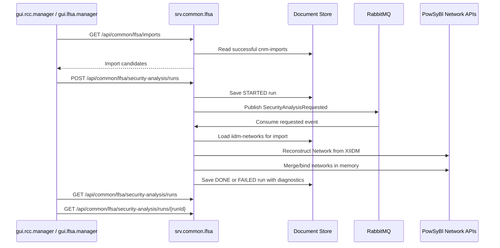

# RCC CSA Design

The RCC module family provides the current Regional Coordination Centre user
surface. It includes CGM import navigation, load-flow/security-analysis,
sensitivity-analysis screens, workflow monitoring placeholders, and placeholders
for future CC and OPC capabilities.

## Module Ownership

- `data.common`: DTOs for network case references, load-flow requests/results,
  security-analysis requests/results, and sensitivity-analysis requests/results.
  DTOs are grouped under `lfsa.common` and `lfsa.sensitivity`.
- `srv.common.lfsa`: reusable load-flow, security-analysis, and
  sensitivity-analysis REST boundary.
- `gui.lfsa.manager`: Vue LFSA manager UI for import search, run start, and
  analysis result browsing.
- `gui.rcc.manager`: Vue RCC manager UI that embeds CGM import and LFSA
  capability screens.
- `mock.srv.common.lfsa`: in-memory service alternative for frontend
  development.

## CSA Flow

## Service Boundaries

Load flow, security analysis, and sensitivity analysis are exposed through the
common LF/SA service because CSA, capacity calculation, and operational planning
can reuse the same contracts. Feature-specific orchestration and BPM modules are
not active in the current reactor.

## GUI

`gui.rcc.manager` has a sidebar with CGM, CSA, CC, OPC, and workflow monitoring.
CGM > Import Manager renders the CNM manager view while preserving configurable
CNM and IIDM backend URLs. CGM > Security Analysis renders the LFSA manager,
which searches successful imports, starts an asynchronous run, and lists stored
run results. CGM > Sensitivity Analysis renders sensitivity configuration,
execution, and result views. CC, OPC, and workflow monitoring remain placeholders
until their services are introduced.

## CGM Security Analysis Flow

