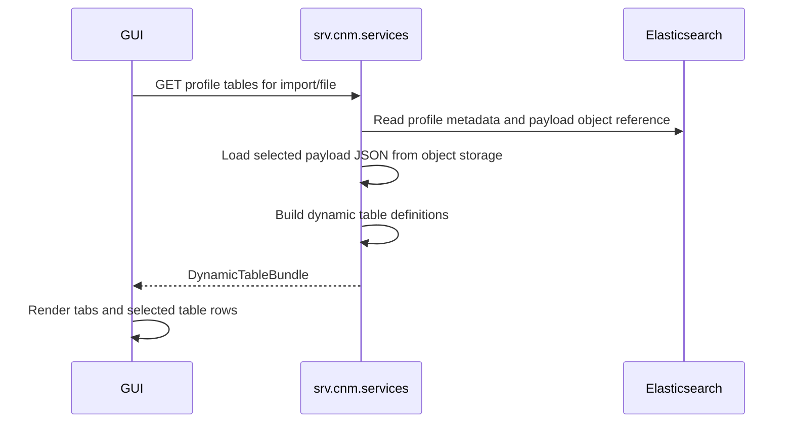

# RDF Metadata Management

RDF metadata management is the profile extraction layer inside
`srv.cnm.services`. It converts RDF/XML source files into lightweight metadata,
profile-specific JSON payloads, and reusable topology fragments without mapping
raw XML directly into IIDM.

## Current Implementation

- `RdfMetadataExtractor` coordinates extraction.
- `RdfXmlProfileParser` uses RDF4J Rio parsing and `CgmStreamingRdfHandler` to
  stream statements into bounded RDF facts.
- `ProfileProcessingContext` carries import/file/group metadata through the
  extraction path.
- `CgmesProfileExtractionStrategy`, `NCProfileExtractionStrategy`, and
  `UnknownProfileExtractionStrategy` map facts into profile payload DTOs.
- `CgmSnapshotAssembler` stitches parsed fragments into a network snapshot using
  mRID lookup data.

## Profile Families

`ProfileFamily` contains only `CGMES`, `NCP`, and `Unknown`. Profile type values
belong to:

- `CgmesProfileKind`: EQ, TP, SSH, SV, DL, GL, DY, SC, OP, AP, EQ_BD, TP_BD,
  EQ_OP, EQ_SC, EQ_CO, CO, MF, and Unknown.
- `NCProfileKind`: Network Code profile kinds used by NCP payloads.

Boundary filenames such as `EQBD` and `TPBD` are normalized to the CGMES
boundary profile kinds.

## Payload Model

The extractor stores two kinds of profile data:

- searchable metadata in `cnm-profiles`
- full typed JSON payloads in MinIO, referenced by `cnm-profile-payloads`

Profile JSON is stored as JSON text in object storage, not as binary data in
Elasticsearch. `cnm-profile-payloads` keeps the profile JSON type, object
bucket/key, checksum, byte size, entity counts, and diagnostics. DTO to JSON and
JSON to DTO conversion goes through `com.mapping.JsonMappingService`.

Common topology facts are represented through reusable DTOs:

- `GridTopologyObject`
- `GridTopologyRelation`
- `GridTopologyReference`
- `ProfileFragment`
- `MridIndexEntry`

Profile-specific DTOs represent EQ, TP, SSH, SV, DL, GL, and NC payloads while
referencing common topology where possible.

## Two-Pass Snapshot Assembly

Snapshot assembly is separate from raw RDF parsing:

1. Parsed files produce profile fragments and mRID index rows.
2. Once all files in a model group are parsed, the snapshot assembler instantiates
   core topology objects.
3. A second pass resolves relationships and state values across EQ, TP, SSH, and
   SV fragments.
4. Snapshot metadata is stored separately from snapshot payload object
   references.

Profile fragments and snapshot sections follow the same storage split as
profile payloads: the full JSON is stored in MinIO, while Elasticsearch stores
the reference and the fields required for lookup and diagnostics.

This preserves partial profile diagnostics even when full snapshot assembly or
IIDM conversion fails.

## Dynamic Tables

Profile content endpoints return `DynamicTableBundle` values. GUI modules render
them through `gui.common.DynamicTable`, so table headers are generated from the
stored profile payload rather than hardcoded per profile.

The table flow is:

## Diagnostics

Parsing errors, unknown profile kinds, unsupported profile features, and
extraction warnings are persisted with file/profile documents. The GUI uses
shared browser logging from `gui.common` to surface failed fetch calls with
stack traces in browser/container logs.
