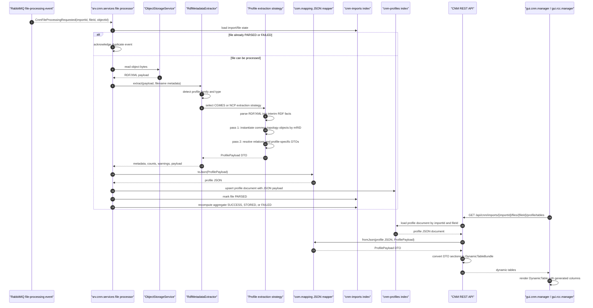

# RDF Metadata Management Design

## Purpose

RDF metadata management extends CNM import processing from filename and profile-reference capture into profile-aware RDF/XML extraction. The design keeps the existing import scope: raw model files are stored first, metadata processing runs asynchronously, and downstream applications consume searchable profile documents rather than raw XML.

The implementation must not map raw RDF/XML directly to IIDM. Each RDF/XML payload is first interpreted into profile DTOs and common topology DTOs in `data.cnm`; those DTOs are serialized as JSON and stored with the processed file profile document. IIDM and analysis flows can then build on typed, persisted profile data.

## Goals

- Detect CGMES and NCP profile type from filename metadata and RDF profile references.
- Keep `ProfileFamily` limited to `CGMES`, `NCP`, and `Unknown`; resolve concrete profile kinds through `CgmesProfileKind` and `NCProfileKind`.
- Extract each known profile into its own DTO representation, such as EQ, SSH, SV, TP, DL, GL, and NC profile-specific payloads.
- Reuse common grid-topology DTOs across profiles so shared concepts such as substations, voltage levels, equipment, terminals, and connectivity relations are not duplicated.
- Store profile data in Elasticsearch as JSON owned by the processed file profile document.
- Convert DTOs to JSON and JSON back to DTOs through `com.mapping`.
- Expose profile content through REST APIs that can be rendered as dynamic tables.
- Add a reusable browser-side logging utility in `gui.common` and use it from `gui.cnm.manager` and `gui.rcc.manager`.

## Module Ownership

- `data.cnm`: owns RDF profile DTOs and common topology DTOs. It remains technology-neutral and has no Spring, Elasticsearch, MinIO, RabbitMQ, Vue, or PowSyBl dependency.
- `data.iidm`: owns PowSyBl IIDM network wrappers and IIDM transformation event contracts. It is populated by the downstream IIDM transformer, not directly by raw RDF/XML parsing.
- `com.mapping`: owns generic DTO/JSON conversion contracts and implementations.
- `srv.cnm.services`: owns asynchronous RDF metadata extraction, profile document persistence, REST APIs, and OpenAPI contract updates.
- `mock.srv.cnm.services`: mirrors the profile-content API shape with in-memory profile table examples.
- `gui.common`: owns `DynamicTable` and browser-side client logging utilities.
- `gui.cnm.manager`: links imported files to profile-content tables and logs client-side errors through `gui.common`.
- `gui.rcc.manager`: embeds the CNM import manager and reuses the same client logging utility for RCC service calls.

## Target Processing Flow

## DTO Design

`data.cnm` should introduce a neutral common topology package that profile DTOs can reference:

- `GridTopologyObject`: mRID, name, object type, profile type, and scalar attributes.
- `GridTopologyReference`: source mRID, target mRID, reference type, and optional profile source.
- `GridTopologyRelation`: relation ID, source, target, relation type, and scalar attributes.
- `ProfilePayload<T>`: profile family, profile type, file ID, object ID, common topology objects, relations, warnings, and the profile-specific DTO.

Profile-specific packages should remain under the existing `data.cnm` domain packages:

- `data.cnm.cgmes`: `CgmesEquipmentProfile`, `CgmesSteadyStateHypothesisProfile`, `CgmesStateVariablesProfile`, `CgmesTopologyProfile`, `CgmesDiagramLayoutProfile`, `CgmesGeographicalLocationProfile`, and shared CGMES profile entities.
- `data.cnm.nc`: Network Code profile DTOs aligned with detected NC profile kinds while preserving `NCP` as the public family value.
- `data.iidm`: remains the dedicated PowSyBl IIDM module and should not be populated directly from raw RDF/XML.

Each profile DTO should store typed collections for the profile it represents. For example:

- EQ: substations, voltage levels, equipment, terminals, base voltage references, regulating controls.
- SSH: operating values, switch states, equipment availability, control setpoints.
- SV: state-variable voltages, angles, flows, injections.
- TP: topology nodes, connectivity-node associations, terminal-node links.
- NCP: NCP-specific entities with references into the common topology model where applicable.

## Extraction Strategy

`RdfMetadataExtractor` is a coordinator rather than a monolithic parser.

1. Detect metadata:
   - Parse filename using `<Timestamp>_<Time Frame>_<TSO Name>_<Profile Type>_<Version>`.
   - Read RDF profile references where present.
   - Resolve `ProfileFamily` and profile type using family-specific profile-kind DTOs.

2. Select strategy:
   - `CgmesProfileExtractionStrategy` for CGMES EQ, SSH, SV, TP, DL, GL, and related profile kinds.
   - `NCProfileExtractionStrategy` for NCP profile kinds.
   - `UnknownProfileExtractionStrategy` for unsupported profiles that still need metadata, warnings, and raw entity counts.

3. Build an interim RDF fact model:
   - Parse RDF/XML with namespace-aware XML APIs or an RDF library owned by the service module.
   - Capture subject mRID, RDF type, scalar properties, and object references.
   - Keep parsing exceptions inside the extraction layer and return actionable warnings or file-level failures.

4. Apply a two-pass pipeline:
   - Pass 1 instantiates topology and profile entities into lookup maps by mRID.
   - Pass 2 resolves references, terminals, connectivity nodes, containers, and profile associations.

5. Return `RdfMetadata`:
   - filename metadata
   - profile family and type
   - detected profile kind
   - entity counts
   - warnings
   - typed `ProfilePayload<?>`

`ProfileProcessingContext` is the explicit hand-off object between the import
processor and the RDF extraction layer. It carries import ID, file ID, object ID,
TSO, business day, business time, timeframe, detected family/profile type, and
the cached profile-default configuration used during extraction. Its
`queueKey()` method is the canonical serialization key for model-group
processing.

Profile extraction defaults are loaded from cached YAML resources under
`src/main/resources/config/profile/cgmes` and
`src/main/resources/config/profile/nc` in `srv.cnm.services`. The supported-kind
lists are configuration, not hard-coded control flow. Unsupported-but-parseable
profile kinds are retained with diagnostics so import processing can continue.

File-processing events are serialized by import ID, TSO, business day, business
time, and timeframe. This per-model queue key is required because EQ, TP, SSH,
and SV files for a TSO are cross-referenced and should not update shared import
state concurrently.

## Elasticsearch Document Model

Profile persistence is split into searchable metadata and large payload data.
This keeps the profile list/search path small even when RDF files generate large
typed DTO JSON.

The file-level profile document in `cnm-profiles` contains metadata only:

- stable ID derived from `fileId` or `importId:fileId`
- `importId`
- `fileId`
- `fileName`
- `objectId`
- `state`
- `profileFamily`
- `profileType`
- `detectedProfileKind`
- `tsoName`
- `businessDay`
- `businessTime`
- `timeFrame`
- `version`
- `entityCounts`
- `warningCount`
- `errorCount`
- `profileJsonType`
- `importedAt`

The large profile payload is stored in `cnm-profile-payloads`:

- stable ID derived from `fileId`
- `importId`
- `fileId`
- `profileJsonType`
- `profileJson`
- `profileJsonChunks`
- `importedAt`

`profileJson` is stored as JSON text, chunked into `profileJsonChunks` when the
payload is too large for a single field. It should not be dynamically mapped as
nested Elasticsearch fields, because CGMES/NCP profile structures can introduce
conflicting object and scalar shapes across files. Search filters stay on stable
metadata fields in `cnm-profiles`. Profile content exploration loads the payload
by `fileId` from `cnm-profile-payloads` and converts it back to DTOs.

Index mappings should be explicit where `com.infra` supports them. If an index
already exists, startup must not recreate it. New fields should be added
compatibly or handled in the service layer when older documents do not have a
matching payload document.

## Mapping Rules

`com.mapping` should expose a JSON mapping capability that can be reused beyond CNM:

- `JsonMappingService.toJson(Object value)`
- `JsonMappingService.fromJson(String json, Class<T> targetType)`

The implementation can use Jackson internally, but service modules should depend on the `com.mapping` contract rather than using Jackson directly. This keeps DTO/JSON conversion aligned with the existing mapping module ownership.

`srv.cnm.services` uses this mapper when persisting a parsed profile and when serving profile-content APIs. `srv.iidm.transformer` uses the same mapper when reading `cnm-profile-payloads` and writes PowSyBl XIIDM network exports to `iidm-networks`.

## REST API Additions

Add profile-content endpoints to `srv.cnm.services` and the OpenAPI contract:

- `GET /api/cnm/imports/{importId}/files/{fileId}/profile/payload`
  - returns the stored profile JSON payload for a processed file.
- `GET /api/cnm/imports/{importId}/files/{fileId}/profile/tables`
  - returns a `DynamicTableBundle` containing all generated tables for the profile payload.
- `GET /api/cnm/imports/{importId}/files/{fileId}/profile/tables/{tableId}`
  - returns one generated dynamic table.

The mock service should expose the same routes with representative EQ, SSH, SV, and NCP examples.

## GUI Design

`gui.common` should add a `DynamicTable` component for profile content exploration.

Expected behavior:

- Accept a list of table definitions.
- Generate headers from column definitions.
- Support search across visible table values.
- Support client-side sorting.
- Support pagination and scrollable table content.
- Render empty, loading, and error states consistently with existing `DataTable` styling.

`gui.cnm.manager` should make each imported file name clickable in the import-file detail view. Clicking a file calls the profile-content API and opens a profile data view rendered with `DynamicTable`.

`gui.rcc.manager` embeds the CNM manager under CGM Import Manager, so it receives the same profile exploration behavior without duplicating CNM UI logic. The CNM service URL remains environment-configurable through the `cnmBaseUrl` application configuration key.

## Browser-Side Logging

`gui.common` should own shared browser logging utilities:

- `HttpClientError`: wraps failed fetch responses with URL, status, status text, response headers, response body, and stack.
- `logClientError(context, error, details)`: writes grouped browser console diagnostics including context details and stack trace.

`gui.cnm.manager` should use this utility for import listing, file listing, upload, profile search, and profile-table loading failures.

`gui.rcc.manager` should use the same utility for CSA and RCC service calls. Errors visible on the GUI should have enough browser-console detail to identify whether the failure came from route configuration, reverse proxy, backend HTTP response, or client-side processing.

## Implementation Plan

1. Add DTOs in `data.cnm`:
   - common topology DTOs
   - dynamic table DTOs
   - CGMES profile DTOs
   - NCP profile DTOs

2. Add JSON conversion in `com.mapping`:
   - define `JsonMappingService`
   - implement Jackson-backed mapper
   - add focused tests for DTO round-trip behavior

3. Refactor RDF extraction in `srv.cnm.services`:
   - split detection, RDF fact parsing, and profile strategy extraction
   - implement EQ, SSH, SV, TP, and NCP strategy skeletons
   - use two-pass mRID lookup and relation resolution
   - return typed `ProfilePayload<?>`

4. Extend persistence:
   - add profile JSON and profile-content metadata fields to `CnmProfileDocument`
   - update document adapter mappings where supported
   - persist profile JSON during asynchronous event processing
   - keep old documents readable when `profileJson` is missing

5. Add profile-content REST APIs:
   - load the profile document by import ID and file ID
   - expose the stored profile JSON through a file-oriented payload endpoint
   - deserialize profile JSON through `com.mapping`
   - convert payload sections to `DynamicTableBundle`
   - update OpenAPI and mock service

6. Add GUI common capabilities:
   - implement `DynamicTable`
   - implement `HttpClientError` and `logClientError`
   - export both from `gui.common`

7. Update GUI consumers:
   - make CNM import-file rows clickable
   - render profile tables in CNM manager
   - reuse the same flow through RCC manager embedding and configurable `cnmBaseUrl`
   - apply shared error logging to CNM and RCC service calls

8. Verify:
   - Maven tests for `data.cnm`, `com.mapping`, `srv.cnm.services`, and mock service
   - frontend builds for `gui.common`, `gui.cnm.manager`, and `gui.rcc.manager`
   - component-level rendering checks for `DynamicTable` when the project adds a frontend test runner
   - targeted manual check for profile-file click path through RCC manager

## Open Questions

- Whether the first implementation should use a full RDF library or namespace-aware XML extraction for the initial profile DTO population.
- Whether profile JSON should be compressed when very large profile files generate large profile payloads.
- Whether a migration utility should backfill `cnm-profile-payloads` from older
  `cnm-profiles` documents that still contain inline payload fields.
- Whether profile table APIs should support server-side paging for very large profiles in a later increment.
- Whether profile DTOs should include profile-version-specific subclasses once ENTSO-E profile versions diverge materially.
